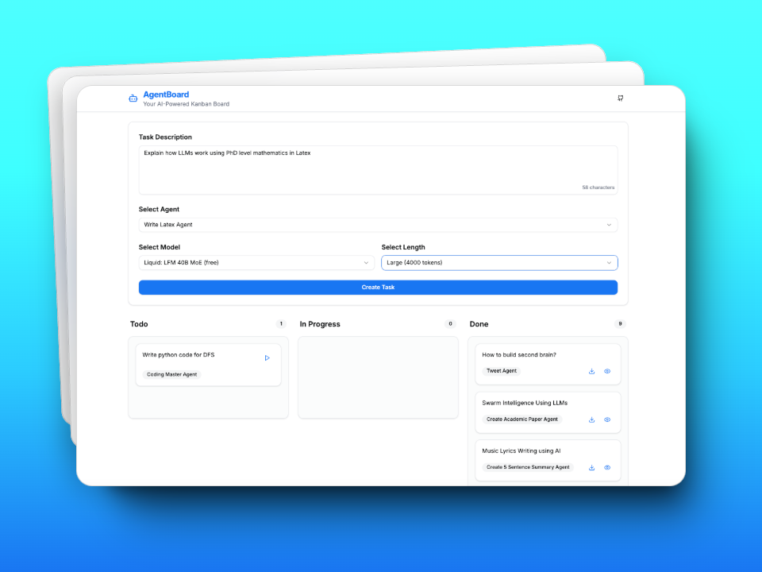

# AgentsBoard

> Your AI-Powered Kanban Board for Task Management with AI Agents
> 
> *Where AI meets productivity in a familiar Kanban interface*

AgentsBoard is a JIRA/Trello-inspired task management system designed for AI agents. Easily input ideas, assign them to AI agents, and track their execution across Todo, In Progress, and Done states.



## 🚀 Features

- 📝 **Effortless Task Creation**: Simple interface for task creation and agent assignment
- 🤖 **AI Agent Integration**: Powered by OpenRouter for access to top AI models
- 🔄 **Automated Task Lifecycle**: Tasks automatically progress through states
- 📊 **Intuitive Kanban Board**: Clear visualization of task progress
- 💾 **Markdown Export**: Download completed tasks in markdown format
- 🎨 **Modern UI**: Built with Next.js 14, Tailwind CSS, and shadcn/ui

## 🌐 Live Demo

Try AgentBoard now: [https://agentsboard.vercel.app](https://agentsboard.vercel.app)

## ⚡ Quick Deploy
Deploy your own instance of AgentBoard with one click:

[](https://vercel.com/new/clone?repository-url=https://github.com/Justmalhar/AgentsBoard&env=NEXT_PUBLIC_OPENROUTER_API_KEY&env=NEXT_PUBLIC_APP_NAME&env=NEXT_PUBLIC_DEFAULT_MODEL&env=OPENROUTER_BASE_URL&env=MAX_REQUESTS_PER_MINUTE)


## 🛠️ Installation

1. Clone the repository:
```bash
git clone https://github.com/Justmalhar/agent-board.git
cd agent-board
```

2. Install dependencies:
```bash
npm install
```

3. Set up environment variables:
```bash
cp .env.example .env.local
```

4. Add your OpenRouter API key to `.env.local`:
```env
NEXT_PUBLIC_OPENROUTER_API_KEY=your_api_key_here
NEXT_PUBLIC_APP_NAME=AgentBoard
NEXT_PUBLIC_DEFAULT_MODEL=liquid/lfm-40b:free
OPENROUTER_BASE_URL=https://openrouter.ai/api/v1
MAX_REQUESTS_PER_MINUTE=60
```

5. Start the development server:
```bash
npm run dev
```

## 📁 Project Structure

```
AgentBoard/
├── app/
│   ├── api/           # API routes for task execution
│   ├── layout.tsx     # Root layout
│   └── page.tsx       # Home page
├── components/        # React components
│   ├── KanbanBoard.tsx
│   ├── TaskCard.tsx
│   └── TaskInput.tsx
├── contexts/         # React contexts
│   └── TaskContext.tsx
├── lib/             # Utility functions
│   └── agents.ts
├── prompts/         # Predefined AI prompts
│   ├── default.md
│   └── ai.md
└── public/          # Static assets
```

## 🤖 Predefined Prompts

AgentBoard comes with predefined prompts in the `/prompts` directory thanks to [Fabric Patterns](https://github.com/danielmiessler/fabric/tree/main/patterns) and [Awesome ChatGPT-Prompts](https://github.com/f/awesome-chatgpt-prompts)

## 🔌 AI Provider

AgentBoard uses [OpenRouter](https://openrouter.ai/) as the AI provider, giving you access to:
- Multiple AI models (Claude, GPT-4, Llama, etc.)
- Flexible token limits
- Cost-effective API calls

## 🎯 How It Works

1. **Create a Task**:
   - Enter task description
   - Select an AI agent
   - Choose model and token length
   - Submit task

2. **Task Execution**:
   - Task appears in Todo column
   - Click Play to execute
   - AI processes the task
   - Results appear in Done column

3. **View Results**:
   - Preview results in markdown
   - Download as .md file
   - Track task status

## 🤝 Contributing

Contributions are welcome! Please feel free to submit a Pull Request.

## 📄 License

This project is licensed under the MIT License - see the [LICENSE](LICENSE) file for details.

## 👨‍💻 Author

Built with ❤️ and AI by [Malhar Ujawane](https://x.com/Justmalhar)

Follow me:
- [X](https://x.com/justmalhar)
- [GitHub](https://github.com/justmalhar)
- [LinkedIn](https://www.linkedin.com/in/justmalhar/)

---

[Report Bug](https://github.com/Justmalhar/agent-board/issues) · [Request Feature](https://github.com/Justmalhar/agent-board/issues)
